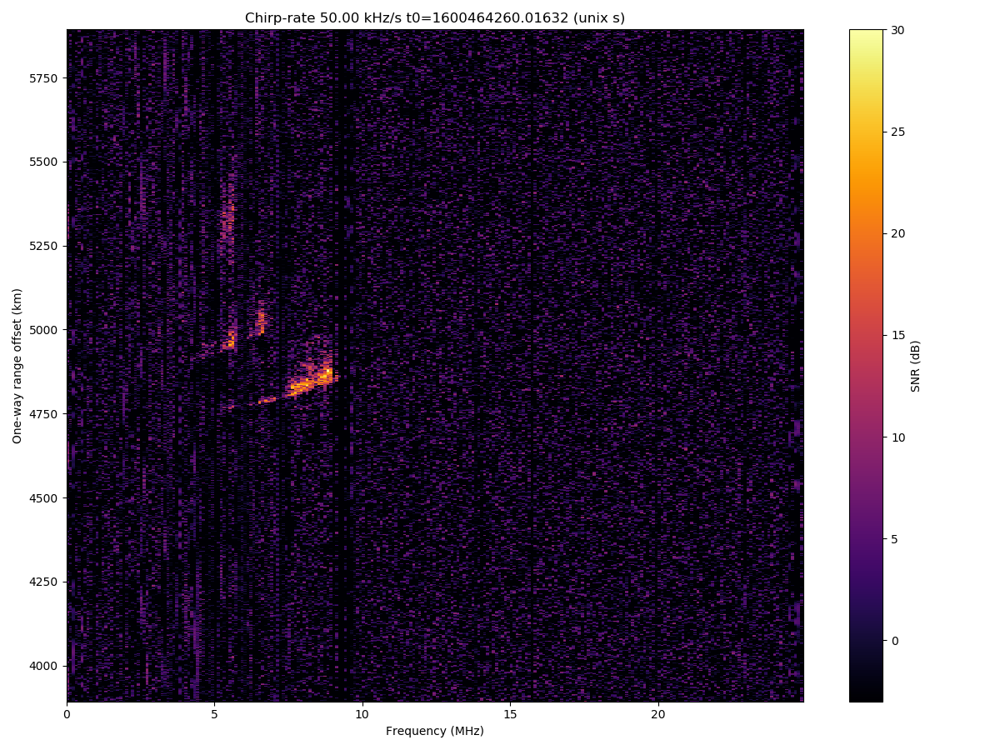
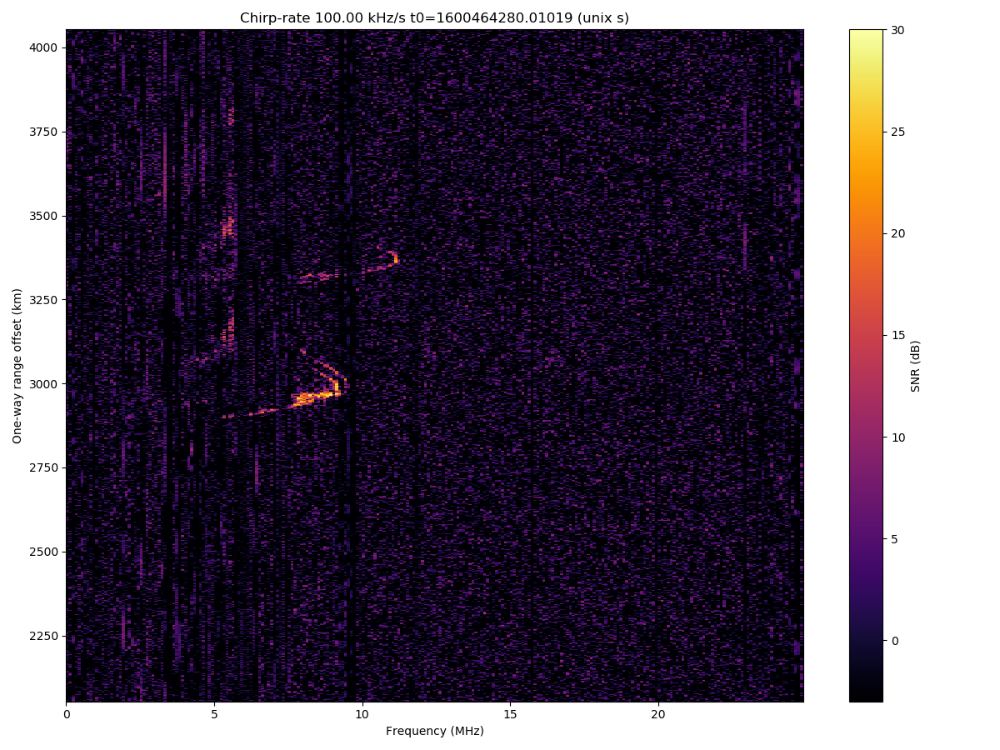
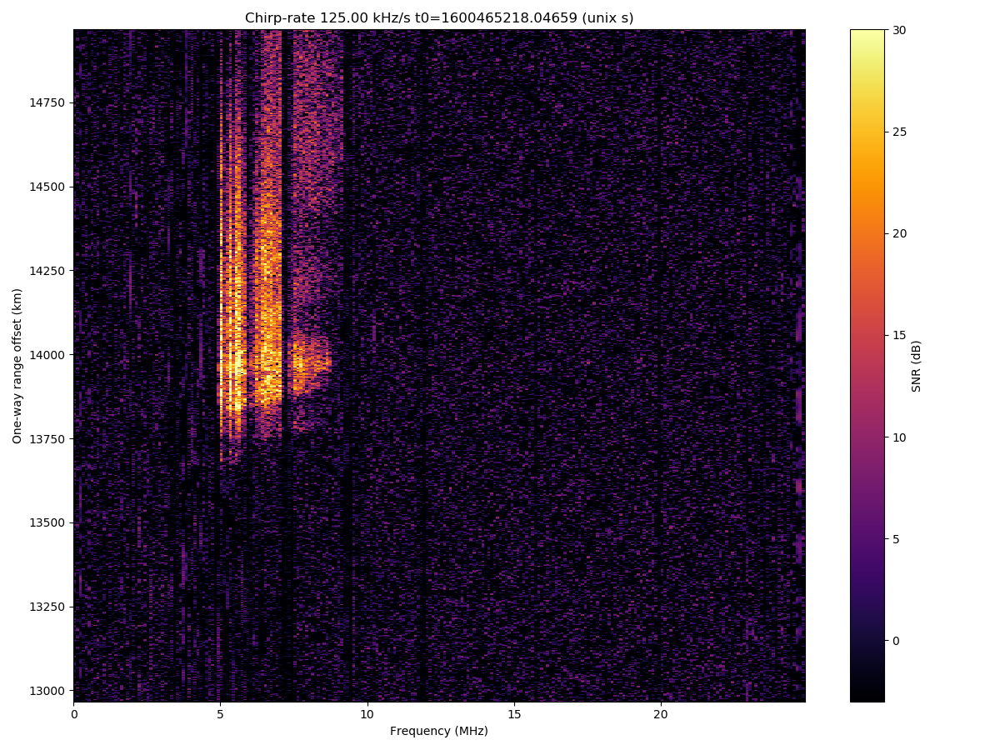
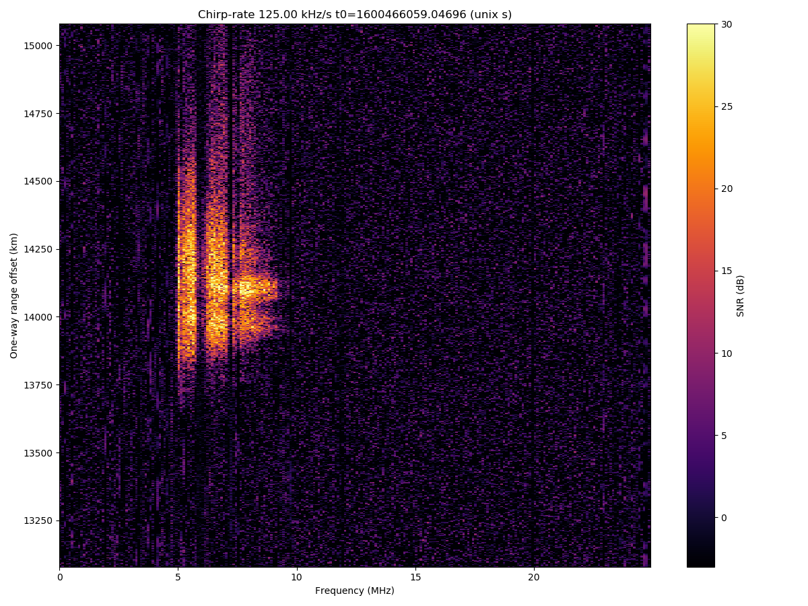

# Chirp Sounder 2

This software can be used to detect chirp sounders over the air, and to calculate ionograms. The software relies on digital rf recordings of HF. 

The software consists of several parts:
 - detect_chirps.py  # this is used to find chirps using a chirp-rate matched filterbank
 - find_timings.py # this is used to cluster detections and determine what chirp timings and chirp rates exist
 - calc_ionograms.py # this is used to calculate ionograms based on parameters
 - plot_ionograms.py # plot calculated ionograms

Version:
Tested on Python 2.7.

Usage:
1) Make a data capture with THOR (comes with <a href="https://github.com/MITHaystack/digital_rf">DigitalRF</a>), a USRP N2x0, a GPSDO, and a broadband HF antenna in a quiet location: 

<code>
thor.py -m 192.168.10.3 -d "A:A" -c cha -f 12.5e6 -r 25e6 /dev/shm/hf25 
</code>

I use use a RAM disk ring buffer to avoid dropped packets, but this is not necessary. The software will be okay with dropped packets.

<code>
# copy digital rf from ram disk to permanent storage:
while true; do rsync -av --remove-source-files --exclude=tmp*
--progress /dev/shm/hf25/cha /data_out/hf25/ ; sleep 1 ; done
</code>

2) configure config_config.py (make sure you have the right center frequency, sample-rate, data directory, and channel name)
3) run detect_chirps.py to detect chirps on the recording
4) run find_timings.py to cluster together multiple detections of the same chirp to create a database of chirp timings
5) run calc_ionograms.py to generate ionograms based on the timings that were found
6) run plot_ionograms.py to create plots

# Examples

