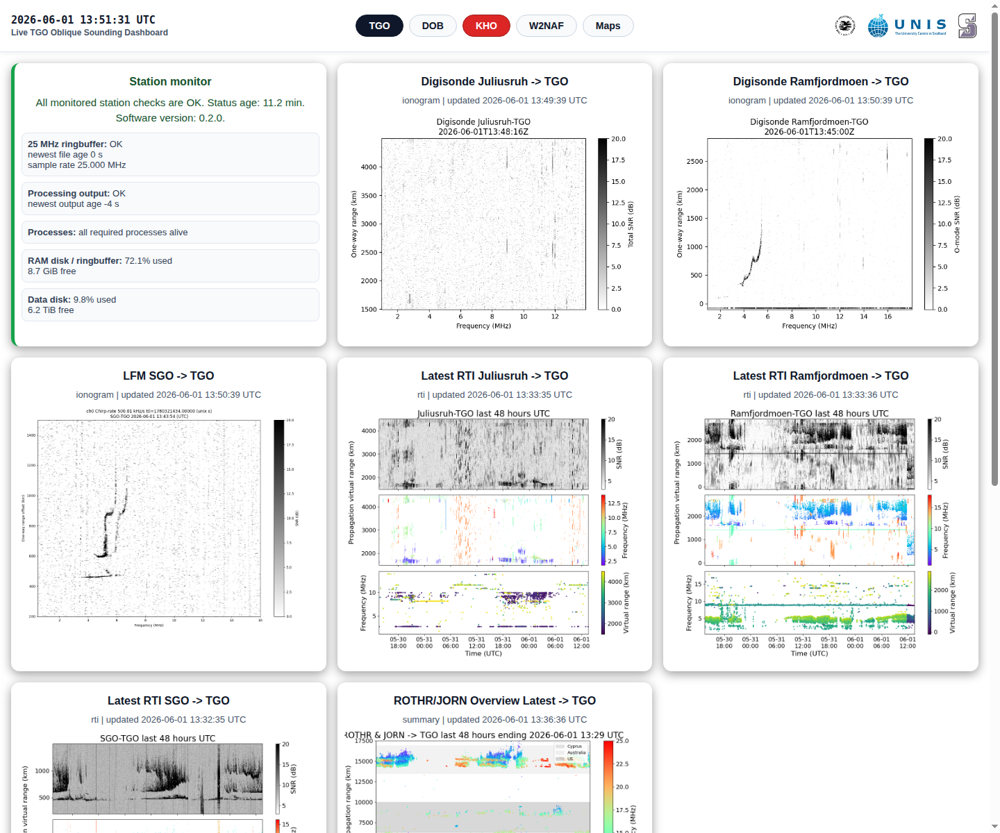
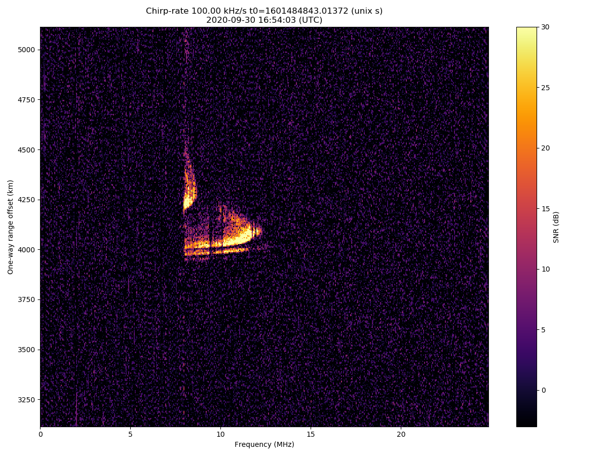
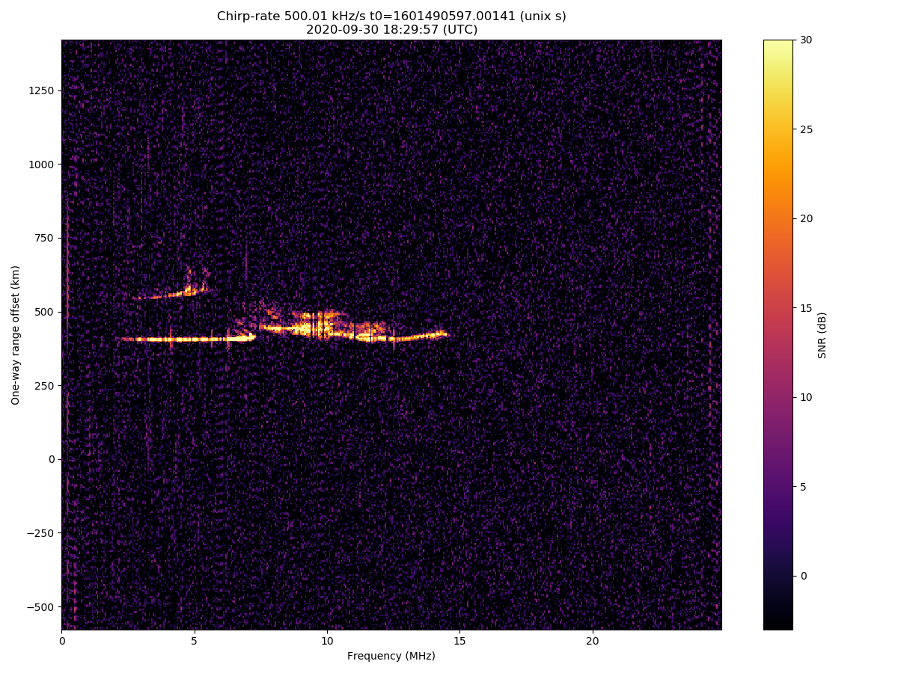
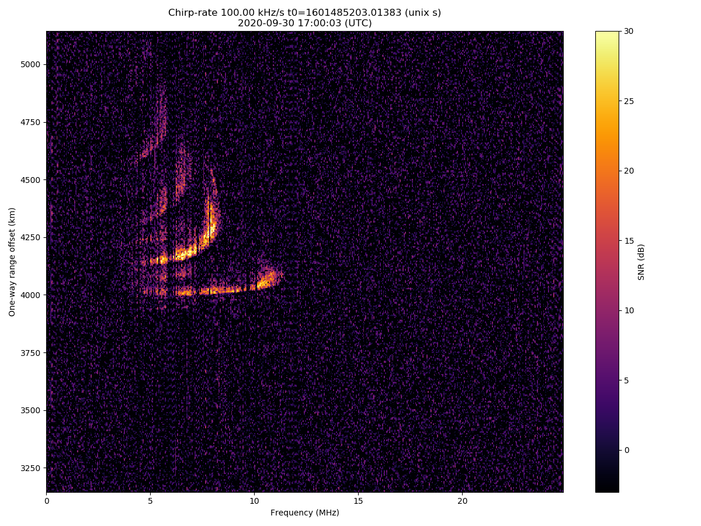
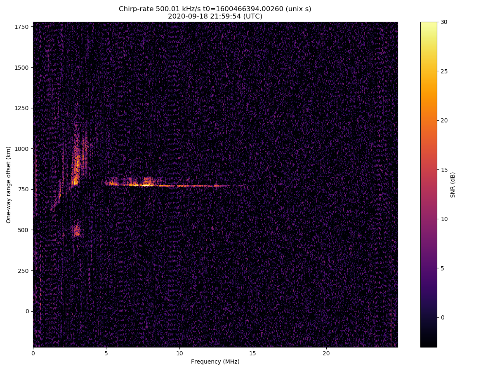
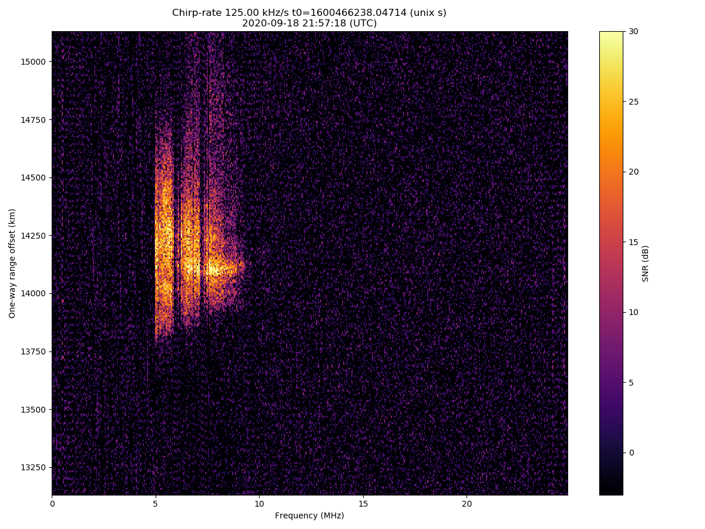
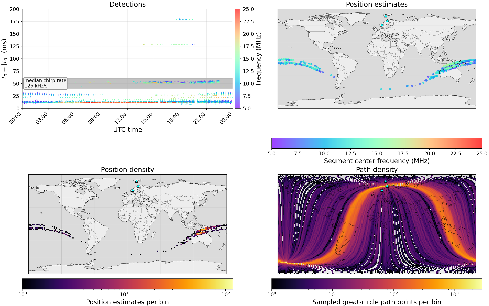
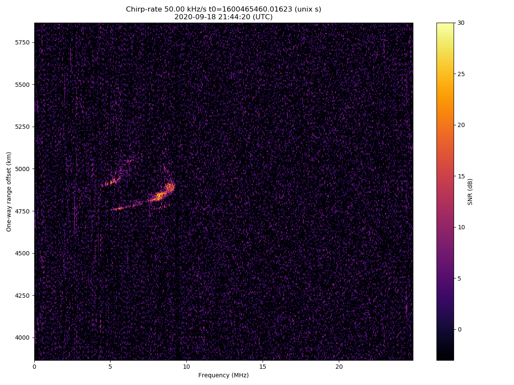

# Chirp Sounder 2

Chirp Sounder 2 detects HF linear-FM chirp sounders in Digital RF recordings and turns them into oblique ionograms. It runs either offline on stored data or continuously on a live Digital RF ringbuffer from a USRP/GPSDO receiver.

Live dashboard: http://4.235.86.214/iono/

The current pipeline is:

1. Record complex HF voltage as Digital RF with `rx_uhd_ext_gps` by default. Use `rx_uhd` only for simpler setups that do not need the external GPS/PPS handling.
2. Detect unknown LFM sweeps with `detect_chirps.py`.
3. Consolidate detections with `detections2metadata.py` and optionally derive repeat timings with `find_timings.py`.
4. Downconvert configured or detected sweeps into ionograms with `calc_ionograms.py`.
5. Plot ionograms, range-time-frequency views, detection summaries, maps, and station health products.

It also includes Digisonde reception for known transmit schedules (`receive_digisonde.py`) and multi-station direction-of-arrival tools for synchronized receivers.

## Examples

Live TGO oblique sounding dashboard:



Cordova AK (Credits: Mike McCarrick, Paul Bernhardt, UAF)


Ramfjordmoen Digisonde received at Prestvannet during auroral sporadic E conditions:


ROTHR Observed from Hawaii (Credits: <a href="https://www.soest.hawaii.edu/soestwp/announce/news/aeronauts-explore-ionosphere/">Arianna Corry, Giuseppe Torri, Univ. of Hawaii</a>)


All of these are observed in Northern Norway (Skibotn). I typically see around 100 ionograms per hour in a recording.

US ROTHR (hard to tell which one, as I'm so far away)



Sodankyla geophysical observatory vertical sounding ionosonde



US ROTHR (hard to tell which one, as I'm so far away)



Sodankyla geophysical observatory vertical sounding ionosonde



Australian JORN. Very far away! I see many of these at the right time of day.



Three-station direction-of-arrival analysis of an Australian JORN chirp-time
band observed from Dombas, Tromso, and Kjell Henriksen Observatory:



US ROTHR (hard to tell which one, as I'm so far away)



## Install

On Ubuntu:

```bash
git clone https://github.com/jvierine/chirpsounder2.git
cd chirpsounder2
./setup_ubuntu_venv.sh
source .venv/bin/activate
```

The setup script installs Python dependencies, Digital RF, UHD build dependencies, realtime/ringbuffer tuning, and builds the local C/C++ helpers. To rebuild later:

```bash
make
```

## Configure

Configuration is INI-style. Start from one of the examples:

```bash
cp examples/marieluise/dombas.ini my_station.ini
```

Important sections:

- `[config]`: station name, realtime/offline mode, Digital RF path, channel, sample rate, center frequency, output directory, ringbuffer cleanup.
- `[detection]`: SNR threshold, block size, search step, chirp rates, and unknown-sounder detection filters.
- `[lfm]`: known LFM sounder timings, downconversion filter, decimation, range/frequency limits, and ionogram storage settings.
- `[digisonde]`: Digisonde receiver settings for known schedules.
- `[transfer]`, `[rtf]`, `[stations]`: dashboard upload, range-time-frequency links, and station metadata.

If a `server.ini` lives next to the station config, shared station/link settings are read before the local config.

## Run

Use `examples/marieluise/dombas.sh` as the live-station template. Edit the paths at the top, point `CONF_FILE` at your config, and start it:

```bash
examples/marieluise/dombas.sh
```

The launcher starts the recorder (`rx_uhd_ext_gps`), chirp detection, ionogram calculation, plotting, Digisonde receivers, station monitoring, housekeeping, and upload/sync jobs. Logs go under `logs/`.

## Programs

The live station is a set of small processes sharing the same config and Digital RF ringbuffer:

- `rx_uhd_ext_gps`: records USRP voltage to Digital RF with GPSDO or external 10 MHz/PPS timing.
- `detect_chirps.py`: searches the live HF band for unknown LFM sweeps and writes detection files.
- `detections2metadata.py`: merges raw detections into compact files for plots, dashboards, and multi-station analysis.
- `calc_ionograms.py`: downconverts configured or detected sweeps and writes LFM ionograms.
- `receive_digisonde.py`: decodes Digisonde soundings with known schedules.
- `plot_ionograms.py`, `plot_rtf.py`, `plot_detectionfiles.py`: make the web/display plots.
- `station_monitor.py`, `iono_housekeeping.py`, `sync_iono_data.py`: monitor health, clean up old files, and publish products.

## Main Outputs

- `chirp-*.h5`: raw detections from `detect_chirps.py`; one file per analyzed block, with chirp time, start frequency, rate, timestamp, and SNR.
- `cdetections-*.h5`: time-binned detection summaries from `detections2metadata.py`; used by dashboards, detection plots, and AoA tools.
- `par-*.h5`: inferred repeating chirp schedules from `find_timings.py`; used for serendipitous ionogram calculation.
- `lfm_ionogram-*.h5`: oblique LFM ionograms from `calc_ionograms.py`; these are the main range-frequency products.
- Digisonde HDF5/PNG products: known-schedule Digisonde ionograms from `receive_digisonde.py`.

## Related

Jens Floberg's [master's thesis](https://munin.uit.no/handle/10037/25828) and Marieluise Schmitt Gran's [thesis](http://juha.no/share/marieluise_thesis.pdf) discuss oblique ionograms made with this software.

You can also detect chirps with a sound card and HF receiver using [Chirpview](https://www.andrewsenior.me.uk/chirpview). University of Twente operates a WebSDR that tracks [known chirp sounders](http://websdr.ewi.utwente.nl:8901/chirps/).
