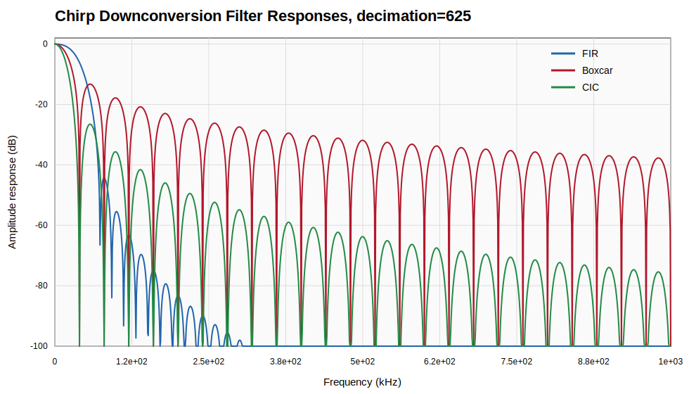
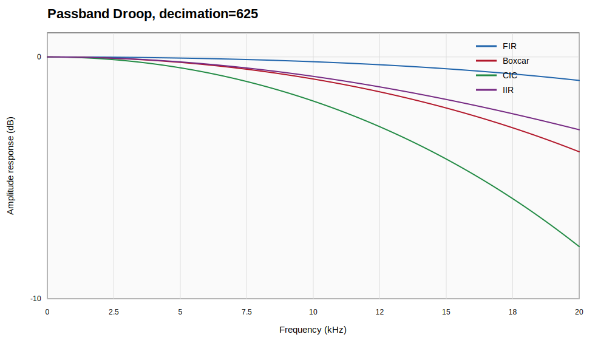

# Chirp Downconversion Filter Responses

The ionogram processor in `calc_ionograms.py` performs chirp downconversion
through `chirp_lib.chirp_downconvert`. The configurable filter is selected with
the `lfm.downconversion_filter` setting. The available options are:

- `fir`: Hann-windowed sinc FIR low-pass filter.
- `boxcar`: one-stage moving-average decimator.
- `cic`: cascaded-integrator-comb decimator with `lfm.cic_stages` stages.

The figures below were generated for `decimation=625`, `filter_len=2`, and
`cic_stages=2`, matching the current Marieluise-style receiver configuration.
The x-axis is normalized to the output Nyquist frequency, so `1.0` corresponds
to `sample_rate / (2 * decimation)`.





## FIR

The `fir` option uses a Hann-windowed ideal sinc low-pass response. In
`chirp_lib.py`, this is constructed as

```python
windows.hann(N) * sin(om0*m) / (pi*m)
```

where `N = filter_len * decimation` and `om0 = 2*pi/decimation`. With the
default `filter_len=2` and `decimation=625`, this is a 1250-tap FIR.

This is the cleanest anti-aliasing option. It has the flattest passband of the
three implemented choices and much better sidelobe suppression than the moving
average. The cost is that each output sample requires a long weighted sum. In
the current C implementation this is threaded and uses AVX when available, but
it is still the most expensive option.

## Boxcar

The `boxcar` option averages one decimation block. Its normalized amplitude
response is

```text
|H(f)| = |sin(pi*f*D) / (D*sin(pi*f))|
```

where `D` is the decimation factor. This filter is computationally cheap and
has nulls at multiples of the output sample rate. However, its first sidelobe
is high and the passband has significant droop: at output Nyquist the response
is about `2/pi`, or approximately `-3.9 dB`.

This is useful when speed matters more than spectral cleanliness.

## CIC

The `cic` option uses a cascaded-integrator-comb filter. Its response is the
boxcar response raised to the number of stages:

```text
|H_cic(f)| = |H_boxcar(f)|^N
```

where `N = cic_stages`. With `cic_stages=2`, the sidelobes are lower than a
single boxcar, but the passband droop doubles in dB. At output Nyquist, the
two-stage CIC response is approximately `-7.8 dB`.

The CIC filter is efficient for streaming decimation because it avoids a long
FIR tap convolution. It is a good compromise when CPU cost is important, but it
is not amplitude-flat unless a compensation filter is added later.

## Computational Cost

For one output sample:

- `fir` uses roughly `filter_len * decimation` complex multiply-accumulates.
  It has the best frequency response, but it is the most CPU intensive.
- `boxcar` uses roughly `decimation` complex additions and one normalization.
  It is fast, but has poor sidelobe suppression and noticeable passband droop.
- `cic` uses integrator updates at input rate and comb updates at output rate.
  It is usually cheaper than the FIR and improves sidelobes relative to the
  boxcar, at the cost of additional passband droop.

The plotting code is in `tools/plot_downconversion_filter_responses.py`.
Regenerate the figures with:

```sh
python3 tools/plot_downconversion_filter_responses.py --decimation 625 --cic-stages 2
```
